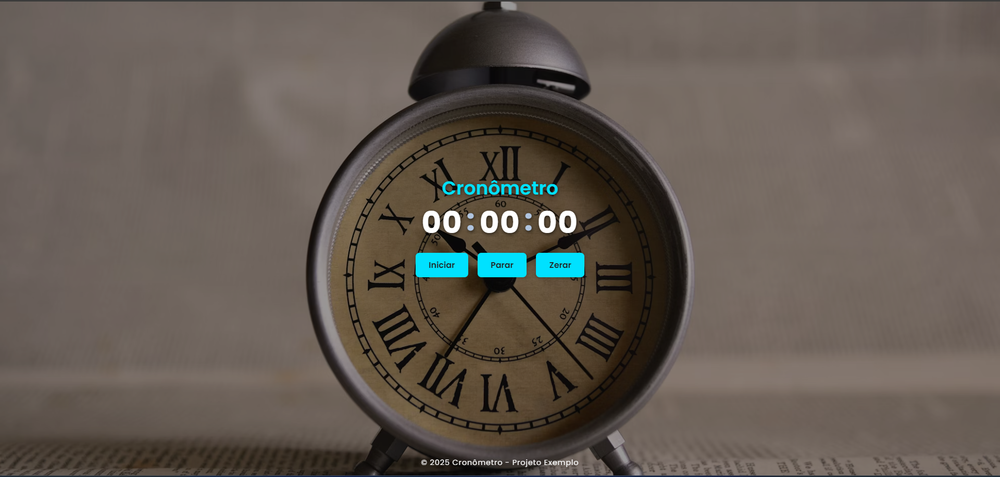

# ⏱️ Cronômetro

Este projeto é um cronômetro simples desenvolvido utilizando **HTML, CSS e JavaScript**. Ele permite iniciar, parar e resetar a contagem do tempo diretamente na interface.

## 🚀 Tecnologias utilizadas

- **HTML** - Estrutura da página
- **CSS** - Estilização da interface
- **JavaScript** - Lógica para controle do cronômetro

## 📌 Funcionalidades

- Iniciar o cronômetro com contagem de horas, minutos e segundos
- Pausar a contagem sem resetar os valores
- Resetar o tempo para 00:00:00
- Exibição dinâmica dos valores na tela

## 🌐 Preview do site

 

Acesse o cronômetro online:  
🔗 [Clique para visualizar]([https://seu-usuario.github.io/nome-do-repositorio/](https://danielmartins22.github.io/Cronometro/))

